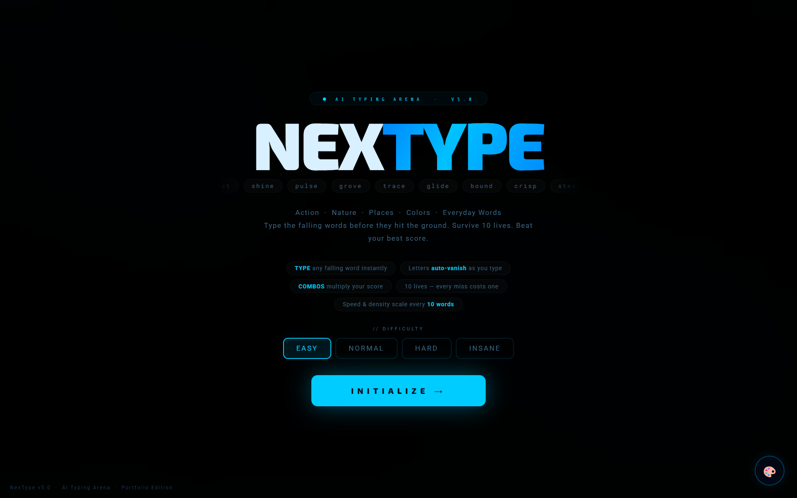
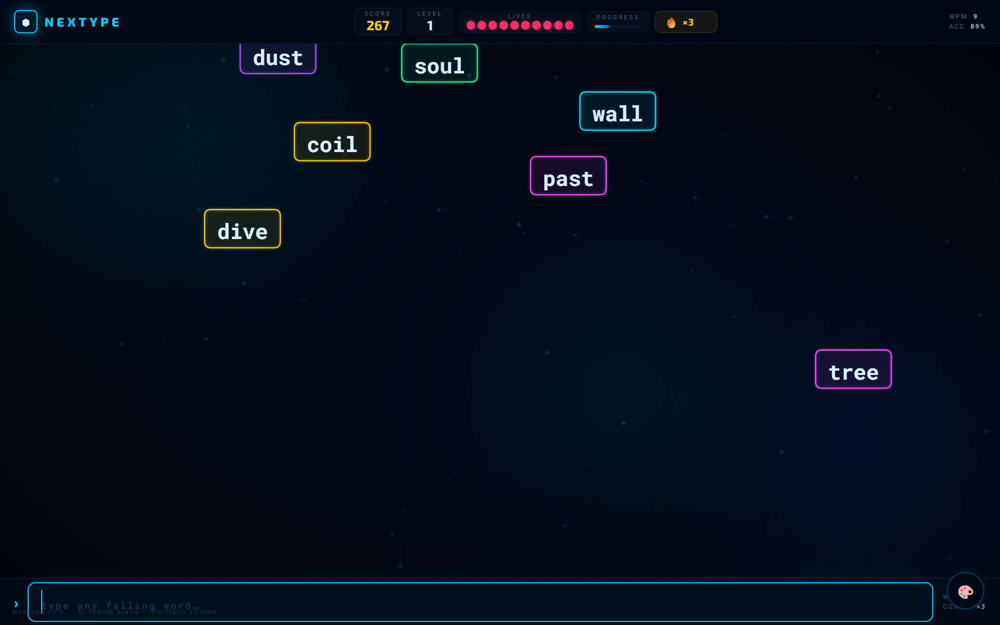
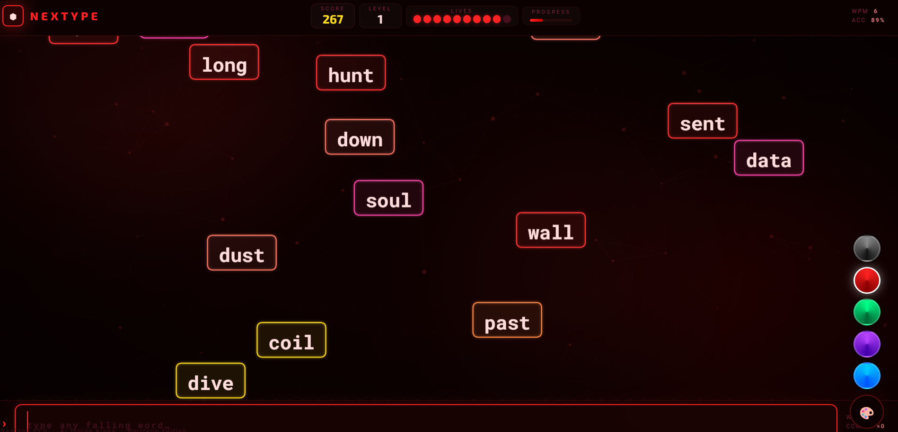
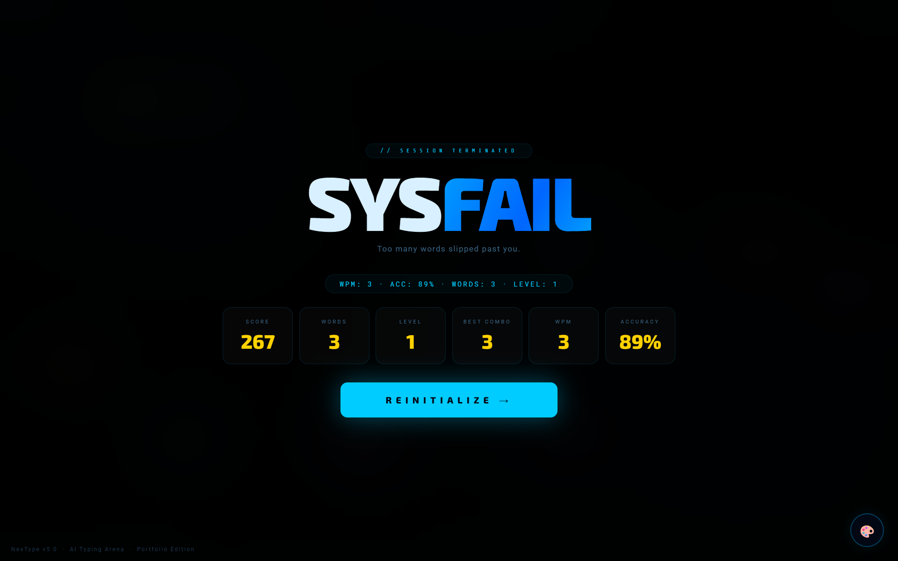

# NexType — AI Typing Arena

## Play Online

[Play NexType](https://ayushverma-in.github.io/nextype-ai-typing-arena/)

A futuristic AI-themed typing game built with Vanilla JavaScript, Canvas API, particle effects, and dynamic neon themes.

---

## Preview

### Start Screen


### Gameplay


### Themes


### Game Over


---

## Features

- Futuristic neon cyberpunk UI
- Multiple animated themes
- Dynamic difficulty system
- Combo multiplier mechanics
- Particle explosion effects
- WPM and accuracy tracking
- Responsive fullscreen gameplay
- Synthesized sound effects
- Canvas-based rendering

---

## Tech Stack

- HTML5
- CSS3
- Vanilla JavaScript
- Canvas API
- Web Audio API

---

## How To Play

Type the falling words before they hit the ground.

- Every missed word costs 1 life
- Combos increase score multiplier
- Difficulty increases as you survive longer
- Survive as long as possible

---

## Project Structure

```bash
nextype-ai-typing-arena/
│
├── index.html
├── css/
├── js/
├── assets/
└── README.md
```

---

## Run Locally

1. Download or clone repository

```bash
git clone https://github.com/yourusername/nextype-ai-typing-arena.git
```

2. Open `index.html` in browser

---

## Author

Created by Ayush Verma
